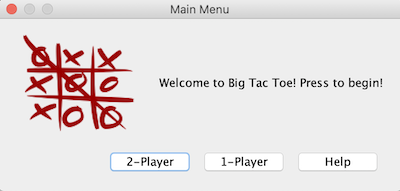
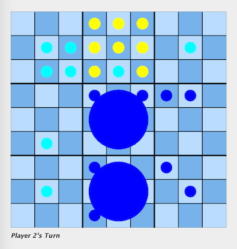
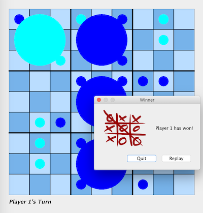

# BigTacToe

### What is BigTacToe
A Java Application that is tic tac toe, but bigger! The tic tac toe games are nested inside of a larger tic tac toe game and affect one another. 

### Instructions 
1. For the first move, the first player can choose a spot in any section.
2. The following player MUST play within the large section that corresponds to the small spot the previous player went in. This applies for all players immediately after the first move.
3. If a player is sent to a filled section or a section with a winner, since no one can play in that section, the player sent there can go anywhere.
4. To win a large section, a player must win a small game of tic-tac-toe by getting three of their pieces in a row (diagonally, horizontally, vertically)
5. The player who wins three in a row of the large sections wins the overall game.

### Modes
##### 1-Player
Play with the computer that uses a random number generator to take a turn. Computer has time delay to allow for a more real life experience. 
##### 2-Player
Play with another person on the same computer. Alternate turns. Label in corner displays which player's turn.

### Colours
**Yellow Pegs** - Playable spots
**Blue Pegs** - Players
**Big Pegs** - Spots that have been won by a player

#### Menu Screen 

#### Game Screen 

#### Win Screen 

